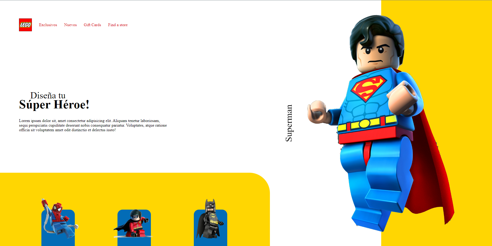

  

<!-- About the Project -->
## :star2: Animaciones con CSS

  

### :bangbang: Prerrequisitos
**Ambiente de desarrollo.**
- HTML 5 
- CSS Grid

**Recursos.**
- [Platzi - Curso Práctico de Maquetación y Animaciones con CSS](https://platzi.com/cursos/animaciones-css-practico/)

